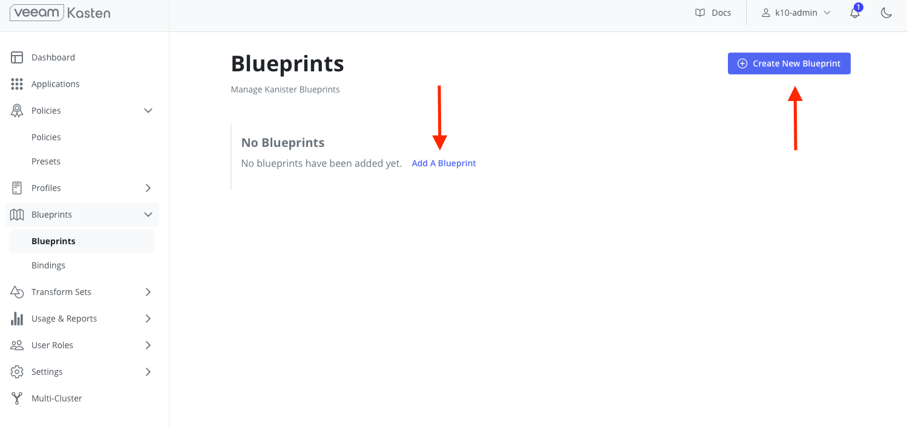
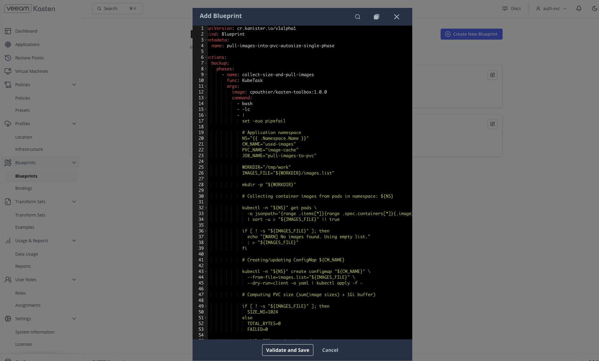
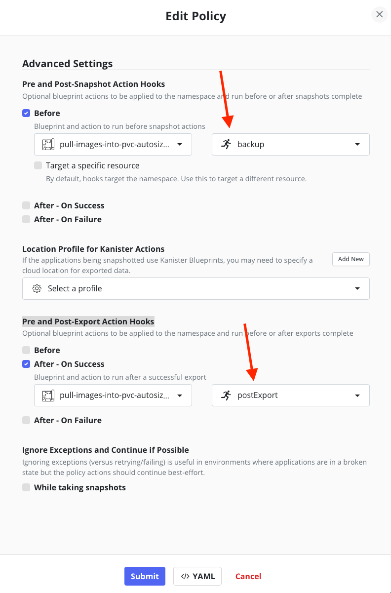

# WORK IN PROGRESS

## Overview
This blueprint collects container images used by pods in a target Namespace, estimates total storage needed, creates a PVC sized to hold all images (with a buffer), and runs a Job to pull each image into the PVC as OCI archives. After the Job completes it cleans up temporary resources; a postExport phase deletes the PVC.

**WARNING**

The provided blueprint **is not supported by the editor and is supplied as-is**. Functionality, compatibility, and correctness are not guaranteed. Please verify and adjust as needed before use.

## Here is a breakdown of its functionality
- Scans pods in the provided Namespace and writes unique image names to a ConfigMap (`used-images`).
- Uses `skopeo` + `jq` to inspect image layer sizes and compute a total size (fallback per-image estimate when inspection fails).
- Creates/updates a PVC (`image-cache`) sized to the computed size in MiB (minimum 1 GiB + 1 GiB buffer).
- Launches a Kubernetes Job (`pull-images-to-pvc`) that:
    - Reads the image list from the ConfigMap.
    - Uses `skopeo copy` to store each image as an OCI archive file in the PVC.
- Waits for Job completion, then deletes the Job and ConfigMap.
- `postExport` phase deletes the created PVC.

# How to use this blueprint

## Prerequisites
- A running Veeam Kasten instance in the cluster.
- The node(s) must be able to reach image registries used by your pods.
- The `cpouthier/kasten-toolbox:1.0.0` image (used by the blueprint) includes `skopeo`, `jq`, and standard shell utilities (this blueprint was written against that image, if you want to create your own image, refer [to this docker file](https://github.com/cpouthier/kasten-imagepull/blob/main/image/dockerfile)).
- A StorageClass that can dynamically provision PVCs (PVC request uses ReadWriteOnce).
- Sufficient RBAC / permissions to create ConfigMaps, PVCs, Jobs and to list/get pods in the target Namespace.

## Important defaults
- Namespace: the target is the Namespace object passed when invoking the Blueprint.
- ConfigMap name: `used-images`
- PVC name: `image-cache`
- Job name: `pull-images-to-pvc`
- Minimum PVC size: 1 GiB (plus an extra 1 GiB buffer)
- Job backoffLimit: 0, wait timeout: 3600s

# Create and apply the blueprint in Veeam Kasten's GUI

In the Veeam Kasten's GUI, click on Blueprints and then "Add a blueprint" or "Create New Blueprint":

In the Add Blueprint screen copy and paste the content of the blueprint. Once you're done, click on "Validate and Save".

## Backup

You can now create your backup policy as usual, but you will need to refer to this blueprint in the "Pre and Post-Export Action Hooks" section and in the "Pre and Post-Export Action Hooks" as shown below and then save the policy.

You can now trigger the policy as usual (run once or scheduled).

If you configured correctly those action hooks:
- The blueprint will be executed prior to snapshots.
- The blueprint will delete the temporary Job and ConfigMap after completion.
- Veeam Kasten will snapshot both the application PVC(s) if any and the PVC containing all the images and export them if specified.
- The `postExport` phase will delete the PVC named `image-cache` to leave the namespace clean.

## Notes & caveats
- If image size inspection fails for an image, the script accounts for it by adding a conservative fallback (512 MiB per failed image).
- The computed PVC size is rounded up to MiB and increased by a 1 GiB buffer.
- If your cluster uses volume resizing policies or you prefer a different StorageClass or PVC name, adapt the Blueprint accordingly.
- Network access and credentials to private registries must be available to `skopeo` (e.g., via node-level credentials or registry auth configured in the pulling image).

## Customization
- Change image/toolbox, PVC names, buffer size, or the image-sanitization logic by editing `blueprint.yaml`.
- If you want to persist archives longer, remove the `postExport` PVC deletion or adapt to snapshot/backup the PVC before deletion.

# Restore process - WIP

- Restore firstly the backed up PVC containing images
- pop up a local registry
- push images from PVC to local registry
- modify deploiments to point to local registry
- restore whole application

<!-- End -->